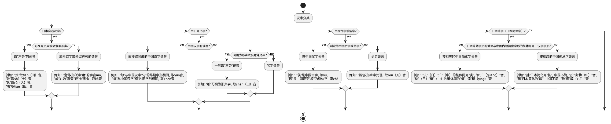
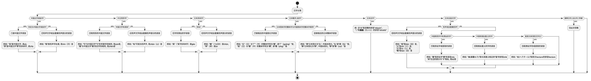

# About the Kokuji
Kokuji, also known as “Japanese kanji characters created in Japan,” are kanji characters that were invented in Japan rather than being imported from China.   
These characters were developed to express concepts, objects, or ideas that were unique to Japanese culture and society. Unlike most kanji, which have their origins in Chinese characters, kokuji were specifically created to meet the linguistic needs of the Japanese language.   
Examples of kokuji include characters such as “峠” (mountain pass), “働” (to work), and “畑” (field). These characters often combine existing kanji components in new ways to create meanings that did not exist in Chinese.

Sources:
- [Kokuji - Wikipedia](https://en.wikipedia.org/wiki/Kokuji)
- [Kokuji: “Made In Japan,” Kanji Edition](https://howto-learn-japanese.blogspot.com/2012/09/kokuji-made-in-japan-kanji-edition.html)
- [Kokuji – Kanji That’s Made In Japan](https://www.lingualift.com/blog/kanji-made-in-japan/)

## How to Determine the Pinyin for Kokuji
The document “日本汉字的汉语读音规范” (i.e. Standard for Chinese Pronunciation of Japanese Kanji) provides guidelines for how to pronounce Japanese kanji in Chinese. 
It categorizes kanji and suggests using Chinese pronunciations where possible, adopting readings from phonetic or semantic components if necessary, and using similar characters when direct readings are not available. 
The following is a flowchart interpreting the 'Standard for Chinese Pronunciation of Japanese Kanji'.

Since there are patterns that do not fit within the ‘Standard for Chinese Pronunciation of Japanese Kanji,’ I expanded the interpretation. The following flowchart was used to determine the pinyin.

# Organized Table of Kokuji
Refer to [Organized-Table-of-Kokuji](https://github.com/MaruTama/kokuji-pinyin-data/wiki).
